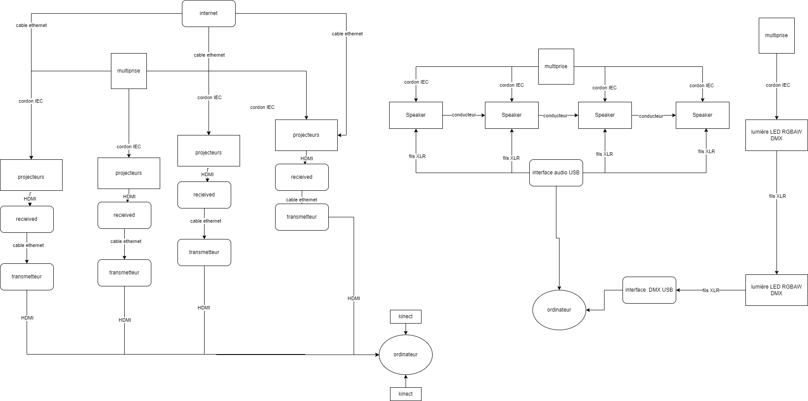

# Préproduction
> C'est ici qu'on dépose les éléments de la préproduction.

# Table des matières
1. [Intention ou concept](#Intention-ou-concept)
    - [Cartographie](#Cartographie)
    - [Intention de départ](#Intention-de-départ)
    - [Synopsis](#Synopsis)
    - [Tableau d'ambiance (*moodboard*)](#Tableau-d'ambiance-(*moodboard*))
    - [Scénario, scénarimage ou document audio/visuel](#Scénario,-scénarimage-ou-document-audio/visuel)
2. [Contenu multimédia à intégrer](#Contenu-multimédia-à-intégrer)
    - [Inventaire du contenu multimédia](#Inventaire-du-contenu-multimédia)
    - [Univers artistique des éléments](#Univers-artistique-des-éléments-centraux)
3. [Planification technique d'un prototype (devis technique)](#Planification-technique-(devis-technique))
    - [Schémas ou plans techniques](#Schémas-ou-plans-techniques)
    - [Matériaux requis](#Matériaux-de-scénographie-requis)
    - [Équipements requis](#Équipements-requis)
    - [Logiciels requis](#Logiciels-requis)
    - [Ressources humaines requises](#Ressources-humaines-requises)
    - [Ressources spatiales requises (rangement et locaux)](#Ressources-spatiales-requises-(rangement-et-locaux))
    - [Contraintes techniques et potentiels problèmes de production](#Contraintes-techniques-et-potentiels-problèmes-de-production)
4. [Planification de la production d'un prototype (budget et étapes de réalisation)](#Planification-de-la-production-(budget-et-étapes-de-réalisation))
    - [Budget prévisionnel](#Budget-prévisionnel)
    - [Échéancier global](#Échéancier-global)
    - [Liste des tâches à réaliser](#Liste-des-tâches-à-réaliser)
    - [Rôles et responsabilités des membres de l'équipe](#Rôles-et-responsabilités-des-membres-de-l'équipe))
    - [Moments des rencontres d'équipe](#Moments-des-rencontres-d'équipe)

# Intention ou concept
## Cartographie
> Exemples:

## Intention de départ
Celestial est une œuvre multimédia immersive qui relie le corps humain et le temps à l’art. L’œuvre consiste à détendre l’interacteur lorsqu’il interagit avec les images abstraites projetés sur les murs qui l’entourent en appuyant sur un mur de toile devant lui. Lorsqu’il n’y a personne dans la zone d’interaction, délimité par un tapis et une lumière, les formes projetés seront rapides et un drone d’ambiance intense sera joué. Lorsque quelqu’un met les pieds dans la zone, les images ralentiront et le drone sera plus calme et relaxant. L’œuvre sera mise en place dans le cyclo du grand studio du Collège Montmorency afin que les projections s’alignent parfaitement, créant un univers immersif autour de l’interacteur. 

## Tableau d'ambiance (*moodboard*)
> Ajoutez ici une liste d'images, de vidéos, de documents audios ou multimédias qui vous inspirent. Une palette de couleur ainsi qu'un choix de typographie devraient également s'y trouver selon la nature du projet.

### Moodbord de l'idée de projet 

### Moodbord Visuel

https://www.youtube.com/watch?v=2k6H5Qa_fCE&t=123s

j'ai pris cette vidéo pour montrer un peu les animation que j'aimerais projeter

## Scénario, scénarimage ou document audio/visuel

Ce que l'interacteur voit quand il arrive à l'installation

L'interacteur met ses souliers/bottes dans la boîte à côté de l'installation. Une lumière s'allumera lorsqu'il détecte un objet dedans

L'interacteur entre dans le cyclo où une projection rapide est projetée sur les murs du cyclo et un spotlight délimite une zone sur le tapis. La projection ralentit et la lumière s'éteint lorsque l'interacteur entre dans la zone délimitée par le spotlight devant le mur extensible.

Lorsque l'interacteur appuie sur la toile, la projection changera à cet endroit. La projection en arrière suit où l'interacteur appuie.

Lorsque l'interacteur arrête d'appuyer la toile, la couleur changera graduellement à partir de la toile jusqu'à en arrière de l'interacteur

# Contenu multimédia à intégrer
## Inventaire du contenu multimédia

- 15 icônes de navigation (pour les utilisateur-trices)
- 8 montages d'image
- 3 paysages sonores
- 5 vidéos d'animation 2D
- 3 textes poétiques
- 7 modules multimédias (ex. captation des données, interprétation des données, contrôle d'éclairage, effets audiovisuels, contrôle vidéo, contrôle de la navigation utilisateur & des différents sous-modules, diffusion et interaction en ligne...).
- ...

Pour plus de détails: [Inventaire du contenu à intégrer](https://cmontmorency365.sharepoint.com/sites/TIM-58266B-Expriencemultimdiainteractive-Enseignants/_layouts/15/Doc.aspx?OR=teams&action=edit&sourcedoc={8D242B82-E599-49CF-BE4C-EA9539D2D1C3})

## Univers artistique des éléments
Voir colonne *Exemples de réalisation* dans l'[Inventaire du contenu à intégrer](https://cmontmorency365.sharepoint.com/sites/TIM-58266B-Expriencemultimdiainteractive-Enseignants/_layouts/15/Doc.aspx?OR=teams&action=edit&sourcedoc={8D242B82-E599-49CF-BE4C-EA9539D2D1C3}).

# Planification technique d'un prototype (devis technique)
## Schémas ou plans techniques
> Insérer plans, documents et schémas pertinents dans cette sectio.  

### Plantation 

> Plantation vu de haut

> Plantation vu de face

> Plantation vu de côté
### Schéma de branchement 

## Matériel de scénographie requis

> Liste des matériaux de scénographie (matériaux de décor) requis ou lien vers un tableur Excel ou document Markdown à part si nécessaire (quantité, spécifications techniques, lien vers fiche technique si applicable, commentaires...)

* Tapis
    * Couleur noir
    * 22,9' x 6,56'
* Cyclorama

## Équipements requis
> Liste des équipements requis par département ou lien vers un tableur Excel ou document Markdown à part si nécessaire (quantité, spécifications techniques, lien vers fiche technique si applicable, commentaires...)

* Audio
    * 4 haut-parleurs actifs de 4"
    * 5 fils XLR 3 conducteurs de 15' (M->F)
    * Interface audio USB disposant 8 sorties 

* Vidéo
    * 4 projecteurs vidéo lentille standard
    * 4 système d'acrochage
    * 2 kinect
    * 4 cables HTMI

* Lumière
    * 2 lumière LED RGBAW DMX
    * 2 fils XLR 3 conducteurs de 20'
    * Interface DMX USB

* Électricité
    * 8 cordon IEC (pour l'alimentation des haut-parleurs)
    * 2 extentions 3 fiches et 3 conducteurs 
    * 4 multiprise

* Réseau
    * 4 fils cat6a de 15"
    * 8 cables ethernet
    * 4 received et transmited

* Ordinateur
    * 2 ordinateur portable 
    
* Autre
    * toile 8/10 pieds et fil 5 pieds de long
    * beton

## Logiciels requis
> Liste des logiciels requis, version ainsi que leurs dépendences

* [TouchDesigner](https://derivative.ca/) 
    * [QlC+](https://www.qlcplus.org/)
* [OBS](https://obsproject.com/)   

## Ressources humaines requises
> Formaté en liste ou en lien vers un tableur Excel.

* TTP, location de matériel
* Guillaume

## Ressources spatiales requises (rangement et locaux)
> Spécifications des espaces nécessaires formaté en liste ou lien vers un tableur Excel.

* Grand studio
    * Projection vidéo dans le cyclo
    * Capatation vidéo
    * Toile Spandex extensible

## Contraintes techniques et potentiels problèmes de production

[problèmes envisgés](https://cmontmorency365-my.sharepoint.com/:x:/r/personal/2052728_cmontmorency_qc_ca/Documents/Classeur1.xlsx?d=wedb6d769c88843739365054fcd1149ee&csf=1&web=1&e=hBobIN)

# Planification de la production d'un prototype (budget et étapes de réalisation)
## Budget prévisionnel

[Lien vers document](https://cmontmorency365.sharepoint.com/:x:/s/TIM-58266B-Expriencemultimdiainteractive-Enseignants/ERS3zx4iKAlLn03N_0h3cyQBOV_nxNuKvrKnqmrXGcgDYg?e=Rjq9Uc)
[Budget](https://cmontmorency365-my.sharepoint.com/:x:/g/personal/2052728_cmontmorency_qc_ca/EQuySqnt1V5Lp-1WpiS0FhwB0_P74i3e_VFehdjQoZS8JQ?e=9bTmcS)

## Échéancier global
Étapes importantes du projet visualisé dans GitHub (*milestones*):  
https://github.com/tim-montmorency/66B-modele_de_projet/milestones

*Dates importantes :*
- Première itération : lundi x novembre
- Prototype finale : lundi x décembre
- Présentation des projets devant public : jeudi 25 mars (soir)

## Liste des tâches à réaliser
Visualisation des tâches à réaliser dans GitHub selon la méthode Kanban:  
https://github.com/orgs/Houston-we-have-a-project/projects/1/views/1

Inventaire des tâches à réaliser dans GitHub selon le répertoire d'*issues*:  
https://github.com/Houston-we-have-a-project/Projet-final-2024-planification/issues?q=is%3Aopen+is%3Aissue

## Rôles et responsabilités des membres de l'équipe
> Il vous est proposé ici de nommer une personne à la coordination générale du projet, à la coordination technique et à la coordination artistique. Les grandes décisions sur les grandes orientations du projet devraient se prendre en groupe lors de rencontres d'équipe. Cependant, les décisions entre vos rencontres de groupe devraient appartenir à ces personnes.

**Laurie Houde**
- Coordination générale du projet (coordination de l'échéancier, du budget, suivi de la liste des tâches à réaliser, s'assurer de la répartition du rôle et des responsabilités des membres de l'équipe);
- Gestion du spotlight dirigé vers le tapis;
- Fonctionnement des élément de la boîte à souliers.

Liste des tâches dans Git Hub:  
https://github.com/Houston-we-have-a-project/Projet-final-2024-planification/issues/assigned/lauriehoude
https://github.com/orgs/Houston-we-have-a-project/projects/1/views/1?filterQuery=assignee%3Alauriehoude

**Felix Testa Radovanovic**
- Comité Technique et coordination technique (suivi du devis technique);
- Programmation dans TouchDesigner de la détection de distance avec Kinect;
- Programmation dans TouchDesigner de la modification visuelle et sonore;
- Installation de l'équipement dans l'espace physique.

Liste des tâches dans Git Hub:  
https://github.com/Houston-we-have-a-project/Projet-final-2024-planification/issues/assigned/im-boyo 
https://github.com/orgs/Houston-we-have-a-project/projects/1/views/1?filterQuery=assignee%3A%22im-boyo%22

**Jolyanne Desjardins**
- Coordination artistique (attention plus particulière pour s'assurer que l'intention/concept artistique du projet initial reste, sinon consulter les membres de l'équipe);
- Mapping vidéo;
- Communication entre les projecteurs avec TouchDesigner et MadMapper;

Liste des tâches dans Git Hub:  
https://github.com/Houston-we-have-a-project/Projet-final-2024-planification/issues/assigned/jolyanneDesgardins
https://github.com/orgs/Houston-we-have-a-project/projects/1/views/1?filterQuery=assignee%3AjolyanneDesgardins

**Maïka Désy**
- Coordination artistique (attention plus particulière pour s'assurer que l'intention/concept artistique du projet initial reste, sinon consulter les membres de l'équipe);
- Création des projections;
- Création des drones;

Liste des tâches dans Git Hub:  
https://github.com/Houston-we-have-a-project/Projet-final-2024-planification/issues/assigned/2142692
https://github.com/orgs/Houston-we-have-a-project/projects/1/views/1?filterQuery=assignee%3A2142692

**Tâches pas encore attribuées**  
https://github.com/Houston-we-have-a-project/Projet-final-2024-planification/issues?q=is%3Aopen+is%3Aissue+no%3Aassignee
https://github.com/orgs/Houston-we-have-a-project/projects/1/views/1?filterQuery=no%3Aassignee

## Moments des rencontres d'équipe
Hebdomadaire
- **"y" jour "x"h (1h-2h)** : Rencontre de suivi de projet.

Autre: 
- **"y" jour "x"h (1h-2h)** : Rencontre de suivi de projet.
